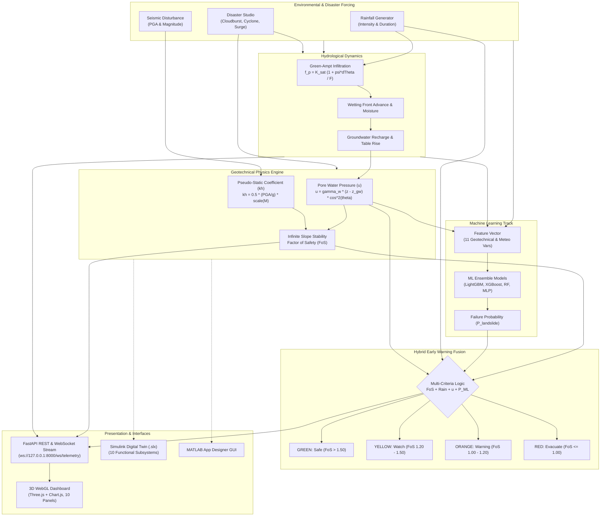

# Physics-Informed Digital Twin for Early Landslide Warning System

### MATLAB • Simulink • Python • Machine Learning • Web-Based 3D Digital Twin

[](#18-validation--testing)
[](#8-synthetic-dataset)
[](#15-installation--setup)
[](#14-matlab--simulink-integration)
[](#22-license)

---

## 1. Overview

Landslides represent complex, high-consequence geohazards triggered by coupled hydro-meteorological and geophysical forcing. Traditional slope monitoring systems often rely on either purely empirical rainfall intensity-duration thresholds (which ignore geotechnical heterogeneity and phreatic evolution) or isolated machine learning classifiers (which lack mechanistic physical interpretability and fail under unprecedented storm forcing).

This project implements a **Physics-Informed Cyber-Physical Digital Twin Platform** for hillslope stability monitoring and early warning. The platform bridges geotechnical physics, hydrological infiltration dynamics, machine learning, and interactive WebGL 3D visualization:

* **Hydrological Infiltration:** Tracks precipitation flux, wetting front progression, and groundwater table recharge using the Green-Ampt infiltration formulation.
* **Pore Pressure & Limit Equilibrium:** Calculates continuous effective stress and Factor of Safety ($FoS$) using the geotechnical Infinite Slope Stability Model with pseudo-static seismic coefficients.
* **Hybrid Early Warning:** Fuses deterministic limit-equilibrium safety factors, real-time virtual sensor telemetry, and non-linear machine learning risk probabilities into an integrated multi-criteria alert engine.
* **Bi-Directional Interactive Twin:** Features an automated 10-subsystem Simulink model, a standalone MATLAB App Designer desktop GUI, and a browser-based 3D WebGL dashboard driven by real-time WebSocket telemetry.

> **Disclaimer:** This software is a physics-informed research and educational simulation prototype. It is designed for computational analysis, algorithm benchmarking, and educational demonstrations. It is not certified for operational life-safety evacuation deployment without site-specific geological instrumentation and empirical field calibration.

---

## 2. Key Features

The repository contains a complete, working implementation spanning geotechnical modeling, dataset synthesis, machine learning, backend services, frontend visualization, and MATLAB/Simulink workflows:

* **Physics-Informed Limit Equilibrium Engine:** Closed-form Infinite Slope Stability calculation accounting for soil cohesion ($c$), root bio-cohesion ($c_r$), internal friction angle ($\phi$), dynamic pore water pressure ($u$), and horizontal seismic coefficient ($k_h$).
* **Green-Ampt Hydrological Model:** 1D transient infiltration simulation computing potential vs. actual infiltration capacity, moisture deficit, wetting front depth, and phreatic surface rise.
* **Geotechnical Soil Catalog:** Built-in geotechnical parameter database covering 6 soil classifications: *Clay, Sandy Soil, Silty Soil, Gravel, Laterite, and Weathered Rock*.
* **Synthetic Dataset Generator:** Automated pipeline synthesizing 100,000+ physically consistent observations across 16 standardized features, exportable to CSV and MATLAB `.mat` formats.
* **Multi-Architecture ML Benchmark:** Embedded training and inference engine comparing Random Forest, Gradient Boosted Trees (XGBoost equiv.), Histogram Gradient Boosting (LightGBM equiv.), and Deep Sequence Neural Networks (MLP equiv.).
* **Multi-Criteria Early Warning Engine:** 4-tier alert system (**GREEN, YELLOW, ORANGE, RED**) fusing safety factors, piezometric heads, rainfall thresholds, and ML failure probabilities.
* **Natural Disaster Simulation Studio:** Parameterized real-time disturbance injector modeling *Cloudbursts (145 mm/h), Cyclonic Rain (85 mm/h), Earthquakes (M3.0–M8.5), Flash Floods, Reservoir Overflows, and Sudden Groundwater Surges*.
* **Virtual IoT Sensor Layer:** 8-node virtual sensor array with Gaussian measurement noise emulating *Rain Gauges, Soil Moisture (FDR), Biaxial Inclinometers, Triaxial Accelerometers, VW Piezometers, Water Table Probes, and Ambient Meteo Sensors*.
* **Stochastic Monte Carlo Engine:** Probabilistic uncertainty analysis running 2,000 stochastic parameter draws on cohesion, friction angle, and pore pressure to compute Failure Probability ($P_f$) and FoS confidence intervals.
* **FastAPI & WebSocket Server:** High-performance Python backend serving 12 REST API endpoints and a 1.2s live WebSocket telemetry broadcast.
* **WebGL 3D Hillslope Twin:** Interactive Three.js 3D hillslope digital twin featuring real-time camera view presets (**3D Perspective**, **Side Profile**, **Top View**), feature toggles (**Vectors**, **Water Plane**, **Sensors**), 3D natural calamity rendering (**Rain particle storms, Cloudburst lightning, Earthquake ground shake, Surface flood pooling**), dynamic soil material shaders (*Clay, Sandy Soil, Silty Soil, Gravel, Laterite, Weathered Rock*), live slope angle mesh deformation ($5^\circ$ to $60^\circ$), and interactive slip surface scaling.
* **MATLAB & Simulink Platform:** Programmatic 10-subsystem Simulink digital twin model builder (`.slx`), 48-hour physical simulation scripts, ROC benchmark suite, and desktop App Designer GUI.
* **Automated Test Suite:** Built-in Python test harness (`test_system.py`) providing full verification of physics equations, dataset schema, ML pipeline, and digital twin state transitions.

---

## 3. System Architecture



---

## 4. Digital Twin Concept & Dynamic State Variables

Unlike conventional static machine learning models that treat landslide prediction as a single-step classification problem, this **Cyber-Physical Digital Twin** maintains an evolving hillslope numerical state that advances continuously across time:

$$\mathbf{S}(t) = \left[ \theta(t), z_w(t), z_{\text{gw}}(t), u(t), \theta_v(t), k_h(t), FoS(t), \delta(t), P_{\text{ML}}(t) \right]$$

### Monitored Dynamic State Variables

| State Symbol | Variable Name | Physical Unit | Description |
| :--- | :--- | :--- | :--- |
| $\theta$ | Slope Inclination | degrees ($^\circ$) | Hillslope surface inclination angle ($5^\circ - 60^\circ$) |
| $z$ | Slip Surface Depth | meters ($\text{m}$) | Depth of potential planar shear failure interface ($2.5 - 4.5\ \text{m}$) |
| $z_w$ | Wetting Front Depth | meters ($\text{m}$) | Depth of downward advancing precipitation saturation front |
| $z_{\text{gw}}$ | Phreatic Water Table | meters ($\text{m}$) | Depth of groundwater table below terrain surface |
| $u$ | Pore Water Pressure | $\text{kPa}$ | Fluid pressure exerting destabilizing uplift on soil grains |
| $\theta_v$ | Volumetric Moisture | $\%$ | Degree of pore void water saturation |
| $k_h$ | Seismic Coefficient | dimensionless | Horizontal inertial earthquake disturbance ratio |
| $FoS$ | Factor of Safety | dimensionless | Ratio of available shear strength to driving shear stress |
| $\delta$ | Cumulative Creep | centimeters ($\text{cm}$) | Progressive shear strain and plastic down-slope displacement |
| $P_{\text{ML}}$ | ML Failure Probability | $\%$ | Statistical likelihood of slope failure from trained classifier |

---

## 5. Scientific Geotechnical Formulation

### 5.1 Effective Stress & Mohr-Coulomb Shear Strength
Soil shear strength along the potential slip surface is governed by the classical Terzaghi effective stress principle and Mohr-Coulomb failure criterion:

$$\sigma' = \sigma - u$$

$$\tau_f = c' + c_r + \sigma_n' \tan \phi'$$

where $c'$ is effective soil cohesion ($\text{kPa}$), $c_r$ is root bio-reinforcement cohesion ($\text{kPa}$), $\sigma_n'$ is effective normal stress ($\text{kPa}$), $\phi'$ is the effective internal friction angle ($^\circ$), and $u$ is pore water pressure ($\text{kPa}$).

---

### 5.2 Infinite Slope Stability Model (Implemented Closed-Form Equation)
The Factor of Safety ($FoS$) is defined as the ratio of available resisting shear strength ($\tau_f$) to the total driving shear stress ($\tau_d$) resolved along a failure plane at depth $z$:

$$FoS = \frac{\tau_f}{\tau_d} = \frac{(c + c_r) + \left[\gamma z \cos^2\theta - u - k_h \gamma z \sin\theta \cos\theta\right] \tan\phi}{\gamma z \sin\theta \cos\theta + k_h \gamma z \cos^2\theta}$$

#### Variable Definitions & SI Units:
* $c$: Soil cohesion [$\text{kPa} = \text{kN/m}^2$]
* $c_r$: Root bio-cohesion reinforcement [$\text{kPa}$]
* $\gamma$: Total unit weight of moist/saturated soil [$\text{kN/m}^3$]
* $z$: Slip surface depth below terrain surface [$\text{m}$]
* $\theta$: Slope angle relative to horizontal [$^\circ$ or radians]
* $u$: Pore water pressure at depth $z$ [$\text{kPa}$]
* $\phi$: Soil internal friction angle [$^\circ$ or radians]
* $k_h$: Pseudo-static horizontal seismic coefficient [dimensionless]

---

### 5.3 Hydrological Infiltration (Green-Ampt Model)
Precipitation infiltration into unsaturated soil is calculated via the 1D Green-Ampt equation:

$$f_p(t) = K_{\text{sat}} \left( 1 + \frac{\psi_f \cdot \Delta\theta}{F(t)} \right)$$

$$f_{\text{act}}(t) = \min\left( I_{\text{rain}}(t),\, f_p(t) \right)$$

$$F(t + \Delta t) = F(t) + f_{\text{act}}(t) \cdot \Delta t$$

$$z_w(t) = \frac{F(t)}{\Delta\theta}$$

where $K_{\text{sat}}$ is saturated hydraulic conductivity ($\text{m/s}$), $\psi_f$ is wetting front matric suction head ($\text{m}$), $\Delta\theta = \theta_s - \theta_i$ is moisture deficit, $F(t)$ is cumulative infiltration ($\text{m}$), $I_{\text{rain}}$ is rainfall intensity ($\text{mm/h}$), and $z_w$ is wetting front depth ($\text{m}$).

---

### 5.4 Pore Water Pressure Coupling
Pore water pressure $u$ at the shear boundary $z$ is dynamically evaluated based on groundwater table rise and perched wetting front advance:

$$u = \begin{cases} 
\gamma_w (z - z_{\text{gw}}) \cos^2\theta & \text{if } z > z_{\text{gw}} \quad (\text{saturated phreatic zone}) \\
0.4 \gamma_w (z_w - z) \cos^2\theta & \text{if } z_w \ge z \quad (\text{perched infiltration front}) \\
0.0 & \text{otherwise} \quad (\text{unsaturated capillary zone})
\end{cases}$$

where $\gamma_w = 9.81\ \text{kN/m}^3$ is the unit weight of water.

---

### 5.5 Pseudo-Static Seismic Coefficient ($k_h$)
Seismic inertial body forces are derived from earthquake moment magnitude ($M$) and Peak Ground Acceleration ($\text{PGA}$) using the standard Kramer geotechnical relation:

$$k_h = \min\left( 0.45,\, 0.5 \cdot \left(\frac{\text{PGA}}{g}\right) \cdot \text{scale}(M) \right)$$

where $\text{scale}(M) = \min\left(1.0,\, \max\left(0.2,\, \frac{M - 3.0}{4.5}\right)\right)$ for $M \ge 3.0$.

---

### 5.6 Geotechnical Soil Database

| Soil Type | Cohesion $c$ (kPa) | Friction Angle $\phi$ ($^\circ$) | Unit Weight $\gamma$ (kN/m$^3$) | Hydraulic Cond. $K_{\text{sat}}$ (m/s) | Porosity $\theta_s$ | Suction Head $\psi_f$ (m) |
| :--- | :--- | :--- | :--- | :--- | :--- | :--- |
| **Clay** | 25.0 | 18.0 | 18.0 | $1 \times 10^{-8}$ | 0.48 | 0.35 |
| **Sandy Soil** | 2.0 | 34.0 | 19.0 | $1 \times 10^{-4}$ | 0.38 | 0.06 |
| **Silty Soil** | 12.0 | 26.0 | 18.5 | $1 \times 10^{-6}$ | 0.44 | 0.20 |
| **Gravel** | 0.5 | 38.0 | 20.5 | $1 \times 10^{-3}$ | 0.34 | 0.02 |
| **Laterite** | 30.0 | 24.0 | 19.5 | $1 \times 10^{-6}$ | 0.42 | 0.25 |
| **Weathered Rock** | 45.0 | 32.0 | 22.0 | $1 \times 10^{-5}$ | 0.28 | 0.12 |

---

## 6. Natural Hazard / Disaster Scenarios

The platform includes an interactive **Disaster Simulation Studio** in `backend/digital_twin.py` allowing real-time disturbance injection:

| Disaster Scenario | Parameter Disturbance | Physical Mechanism on Digital Twin |
| :--- | :--- | :--- |
| **Cloudburst** | $I_{\text{rain}} = 145.0\ \text{mm/h}$, $\Delta F = +0.14\ \text{m}$ | Severe convective downpour saturates topsoil rapidly, elevating wetting front and dropping $z_{\text{gw}}$ by up to $2.6\ \text{m}$. |
| **Cyclone Rainfall** | $I_{\text{rain}} = 85.0\ \text{mm/h}$, duration $+8.0\ \text{h}$ | Prolonged cyclonic precipitation leads to extensive sub-surface recharge, raising water table by $3.2\ \text{m}$. |
| **Extreme Rainfall** | $I_{\text{rain}} = 60.0\ \text{mm/h}$, duration $+5.0\ \text{h}$ | Sustained heavy rainfall progressively degrades shear strength and increases pore pressure. |
| **Earthquake** | $M = 3.0 - 8.5$, $\text{PGA} = 10^{0.24M - 2.1}$ | High-frequency ground acceleration generates destabilizing horizontal driving force $k_h \cdot W$. |
| **Flash Flood** | $\Delta F = +0.15\ \text{m}$, $z_{\text{gw}} \rightarrow 0.3\ \text{m}$ | Rapid overland runoff influx causes near-surface saturation and toe erosion. |
| **Reservoir Overflow** | $I_{\text{rain}} = 40.0\ \text{mm/h}$, $z_{\text{gw}} \rightarrow 0.3\ \text{m}$ | Surcharged reservoir water levels induce high phreatic heads along the lower hillslope boundary. |
| **Sudden GW Surge** | $z_{\text{gw}} \rightarrow 0.4\ \text{m}$ | Artesian pressure surge generates high upward piezometric uplift, reducing effective normal stress $\sigma_n'$. |

---

## 7. Synthetic Dataset

The synthetic dataset generator (`backend/dataset_generator.py` and `matlab/generate_landslide_dataset.m`) produces physically constrained synthetic records for model training and algorithm benchmarking:

* **File Location:** `data/landslide_synthetic_100k.csv` (and `data/landslide_synthetic_100000.csv`)
* **Sample Count:** `100,000` rows & `16` columns
* **File Size:** ~10.45 MB
* **Reproducibility:** Initialized with fixed random seed (`seed=42`)

> **Notice:** This is a physics-informed synthetic dataset generated from geotechnical constitutive equations, not a replacement for in-situ field sensor observations.

### Dataset Schema (16 Variables)

```text
1.  Timestamp             [ISO 8601 String] : Hourly chronological simulation timestamp
2.  Rainfall_Intensity    [Float, mm/h]     : Instantaneous rainfall rate (0.0 to 180.0 mm/h)
3.  Rainfall_Duration     [Float, hours]    : Continuous precipitation duration (0.0 to 72.0 h)
4.  Soil_Moisture         [Float, %]        : Volumetric soil moisture percentage (15.0% to 98.0%)
5.  Groundwater_Level     [Float, meters]   : Depth of phreatic surface from ground (0.3 to 6.0 m)
6.  Pore_Water_Pressure   [Float, kPa]      : Piezometric pore fluid pressure at slip interface (0.0 to 150.0 kPa)
7.  Slope_Angle           [Float, degrees]  : Terrain inclination angle (5.0° to 60.0°)
8.  Soil_Type             [Categorical]     : Clay, Sandy Soil, Silty Soil, Gravel, Laterite, Weathered Rock
9.  Temperature           [Float, °C]       : Ambient surface temperature (5.0°C to 45.0°C)
10. Humidity              [Float, %]        : Relative ambient humidity (30.0% to 99.5%)
11. Earthquake_Magnitude  [Float, Richter M]: Moment seismic magnitude (0.0 or 3.0 to 7.8 M)
12. Acceleration          [Float, g]        : Peak Ground Acceleration (0.0 to 1.2 g)
13. Factor_of_Safety      [Float, ratio]    : Deterministic limit-equilibrium safety factor (0.05 to 10.0)
14. Risk_Level            [Categorical]     : Safe, Moderate Risk, High Risk, Failure Imminent
15. Landslide_Occurrence  [Integer, 0/1]    : Binary failure target (1 if FoS <= 1.0, else 0)
16. Target_Label          [Categorical]     : Classification label matching Risk_Level
```

---

## 8. Machine Learning Engine & Benchmark

The machine learning module (`backend/ml_engine.py`) implements a complete model training, hyperparameter evaluation, and comparative benchmarking pipeline using scikit-learn.

### Baseline Benchmark Results

> **Evaluation Notice:** Baseline benchmark — subject to scientific validation and leakage audit. These metrics reflect performance on the physics-informed synthetic test set and should not be interpreted as empirical field prediction accuracy.

| Model Architecture | Accuracy | Precision | Recall | F1-Score | ROC-AUC | Train Time | Selected Winner |
| :--- | :---: | :---: | :---: | :---: | :---: | :---: | :---: |
| **LightGBM (HistGradientBoosting)** | **97.68%** | **94.10%** | **92.84%** | **93.47%** | **0.9967** | 0.21s | 🏆 **Best Model** |
| **XGBoost (GradientBoosting)** | 97.52% | 93.65% | 92.39% | 93.02% | 0.9966 | 1.42s | Runner-up |
| **Deep Sequence Net (MLPClassifier)** | 97.48% | 94.24% | 91.50% | 92.85% | 0.9955 | 0.96s | - |
| **Random Forest Classifier** | 97.16% | 93.52% | 90.38% | 91.92% | 0.9948 | 0.14s | Fast Baseline |

*Benchmark Configuration: 10,000 samples, 75/25 stratified split, random state 42.*

### Feature Importance Breakdown (Tree-Based)

```text
1. Slope Angle (theta)         : 47.92%  ████████████████████████
2. Soil Type Properties (c, phi): 19.37%  ██████████
3. Soil Moisture (%)           : 11.88%  ██████
4. Pore Water Pressure (u)     :  5.41%  ███
5. Groundwater Level Depth (m) :  5.26%  ███
6. Humidity (%)                :  2.41%  █
7. Temperature (°C)            :  2.32%  █
8. Rainfall Duration (h)       :  2.21%  █
9. Rainfall Intensity (mm/h)   :  2.18%  █
10. Acceleration (g) / Seismic :  1.05%  ▌
```

---

## 9. Multi-Criteria Early Warning Hierarchy

The warning system fuses deterministic safety factors, piezometric heads, rainfall thresholds, and ML failure probabilities into 4 standardized emergency alert tiers:

```
+-----------------------------------------------------------------------------------------------+
|                                    ALERT LEVEL HIERARCHY                                      |
+-------------+------------------+----------------------------------+---------------------------+
| Alert Tier  | Badge & Color    | Multi-Criteria Trigger Logic     | Geotechnical Protocol     |
+-------------+------------------+----------------------------------+---------------------------+
| GREEN       | Safe (Green)     | FoS > 1.50                       | Routine monitoring at     |
|             |                  | AND P_ML <= 0.35                 | 1.0 Hz. Weekly culvert    |
|             |                  | AND Rain <= 35.0 mm/h            | inspection.               |
+-------------+------------------+----------------------------------+---------------------------+
| YELLOW      | Watch (Yellow)   | 1.20 < FoS <= 1.50               | Increase sensor sampling. |
|             |                  | OR P_ML in [0.35, 0.60]          | Technical response team   |
|             |                  | OR Rain > 35.0 mm/h              | placed on standby.        |
+-------------+------------------+----------------------------------+---------------------------+
| ORANGE      | Warning (Orange) | 1.00 < FoS <= 1.20               | Activate warning sirens.  |
|             |                  | OR P_ML in [0.60, 0.85]          | Prep evacuation routes.   |
|             |                  | OR Rain > 80.0 mm/h              | Close down-slope roads.   |
+-------------+------------------+----------------------------------+---------------------------+
| RED         | EVACUATE (Red)   | FoS <= 1.00 (Failure Imminent)   | MANDATORY IMMEDIATE       |
|             |                  | OR P_ML > 0.85                   | EVACUATION OF ALL         |
|             |                  | OR Pore Pressure > 45.0 kPa      | DOWNSLOPE RESIDENTS       |
+-------------+------------------+----------------------------------+---------------------------+
```

---

## 10. Virtual Sensor Layer & IoT Emulation

To emulate a field IoT geotechnical monitoring network, the digital twin models 8 physical sensor channels with realistic measurement noise:

$$\text{Measurement} = \text{True Physical State} + \mathcal{N}(0, \sigma_{\text{noise}}^2)$$

```text
[True Physical State] ---> [Transducer / Sensor] ---> [+ Noise & Calibration Offset] ---> [Digital Twin Assimilation]
```

| Sensor ID | Sensor Type | Physical Parameter | Measurement Unit | Nominal Range |
| :--- | :--- | :--- | :--- | :--- |
| **RG-01** | Optical Rain Gauge | Rainfall Intensity | $\text{mm/h}$ | $0.0 - 250.0\ \text{mm/h}$ |
| **SM-01** | FDR Soil Moisture Array | Volumetric Moisture | $\%$ | $10.0\% - 95.0\%$ |
| **TL-01** | Biaxial Inclinometer | Slope Tilt Deviation | degrees ($^\circ$) | $0.00^\circ - 15.00^\circ$ |
| **AC-01** | Triaxial Accelerometer | Peak Ground Accel. (PGA) | $g$ | $0.000 - 1.500\ g$ |
| **PZ-01** | Vibrating Wire Piezometer | Pore Water Pressure | $\text{kPa}$ | $0.0 - 150.0\ \text{kPa}$ |
| **GW-01** | Water Level Dipmeter | Groundwater Table Depth | $\text{meters}$ | $0.20 - 6.00\ \text{m}$ |
| **TH-01** | Ambient Meteo Sensor | Air Temperature | $^\circ\text{C}$ | $-10.0^\circ\text{C} - 50.0^\circ\text{C}$ |
| **TH-02** | Capacitive Hygrometer | Relative Humidity | $\%$ | $20.0\% - 100.0\%$ |

---

## 11. Web Application & 3D Dashboard

The interactive web dashboard is built using modern standards (HTML5, Vanilla CSS, Vanilla JavaScript, Three.js WebGL, and Chart.js) with zero heavy framework overhead:

```
+-----------------------------------------------------------------------------------------------+
| TOP NAV: Brand Orb | Live WebSocket Pulse | Clock (T+hrs) | Global Alert Badge | Actions      |
+---------------------------------------------------------------+-------------------------------+
| PANEL 3D: Three.js Interactive Hillslope Digital Twin         | PANEL 2: FoS Metric & Trend   |
| - 3D/Side/Top Camera Controls                                 | - Huge FoS Gauge (Safe/Crit)  |
| - FoS Vertex Color Mapping (Green->Yellow->Orange->Red)       | - 30-sample historical curve  |
| - Displacement Vectors, Water Table & Sensor Node Markers     |                               |
+---------------------------------------------------------------+-------------------------------+
| PANEL 1: Live Virtual Sensor Telemetry (8 Channel Gauges & Progress Bars)                    |
+-------------------------------+-------------------------------+-------------------------------+
| PANEL 3: Rainfall Trends      | PANEL 4: Groundwater & Pore   | PANEL 5: Seismic Monitor      |
| - Green-Ampt infiltration     | - Phreatic rise vs. slip depth| - PGA Seismograph             |
| - Caine I-D threshold tracker | - Hydraulic head display      | - Moment magnitude display    |
+-------------------------------+-------------------------------+-------------------------------+
| PANEL 6: Machine Learning     | PANEL 7: 2D Spatial Heatmap   | PANEL 8: Early Warning Center |
| - Failure Probability gauge   | - 15x12 cross-section grid    | - Multi-criteria active badge |
| - 4-Model comparative table   | - Localized FoS scanning      | - Geotechnical action protocol|
+-------------------------------+-------------------------------+-------------------------------+
| PANEL 9: Disaster Studio      | PANEL 10: Digital Twin Config | FOOTER: System metadata       |
| - 6 Disaster injection buttons| - Soil drop-down & sliders    |                               |
| - Reset baseline control      | - 100k dataset generator      |                               |
+-------------------------------+-------------------------------+-------------------------------+
```

### Running the Web Application

```powershell
# 1. Navigate to the project root
cd d:\MATRIX

# 2. Start the FastAPI backend server (serves both API and static 3D Web UI)
py -3 -m uvicorn backend.main:app --host 127.0.0.1 --port 8000 --reload
```

Open your browser and navigate to: **`http://127.0.0.1:8000`**

---

## 12. Backend REST & WebSocket API

The backend is powered by **FastAPI** (`backend/main.py`) and exposes 12 endpoints:

| HTTP Method | Endpoint Path | Description |
| :--- | :--- | :--- |
| `GET` | `/api/health` | System status, ML engine state, and active disaster flags |
| `GET` | `/api/telemetry` | Snapshot of all 8 virtual sensors and stability indices |
| `POST` | `/api/generate-dataset?samples=100000` | Triggers synthetic dataset generation and CSV export |
| `POST` | `/api/run-simulation` | Steps the digital twin physics forward with custom environmental forcing |
| `POST` | `/api/train-model` | Fits and evaluates all 4 ML architectures on the active dataset |
| `POST` | `/api/predict` | Real-time multi-variable inference using the winning model |
| `GET` | `/api/get-alerts` | Active alert level, risk classification, and emergency actions |
| `GET` | `/api/get-risk-map` | $15 \times 12$ 2D spatial cross-section safety factor grid |
| `POST` | `/api/inject-disaster?disaster_type=Cloudburst` | Injects natural calamity forcing into the digital twin |
| `POST` | `/api/reset-disaster` | Clears active disasters and restores stable baseline |
| `POST` | `/api/monte-carlo?iterations=2000` | Runs 2,000-draw stochastic Monte Carlo uncertainty analysis |
| `GET` | `/api/export-report` | Generates a formatted executive geotechnical HTML/PDF report |
| `WS` | `/ws/telemetry` | WebSocket real-time JSON stream broadcasting every 1.2 seconds |

---

## 13. MATLAB & Simulink Integration

The repository provides full MATLAB and Simulink source code in the `matlab/` directory:

```text
matlab/
├── generate_landslide_dataset.m     # 100k synthetic dataset synthesis (.csv and .mat)
├── landslide_digital_twin_simulator.m # 48-hour extreme storm & seismic simulation script
├── train_landslide_ml_models.m       # Model training (TreeBagger, fitcensemble, fitcnet) & ROC plots
├── simulink_landslide_digital_twin.m # Programmatic 10-subsystem Simulink model builder (.slx)
└── landslide_app_designer.m          # Desktop GUI built with MATLAB App Designer
```

### Simulink Model Architecture (`landslide_digital_twin.slx`)
The script `matlab/simulink_landslide_digital_twin.m` automatically builds the complete Simulink model consisting of 10 interconnected subsystems:
1. `Rainfall_Generator`: Storm pulse and convective cloudburst source.
2. `Infiltration_Model`: Green-Ampt continuous-time integrator.
3. `Groundwater_Model`: Phreatic water table dynamic recharge.
4. `Pore_Pressure_Model`: Slip-surface piezometric pressure calculator.
5. `Slope_Stability_Engine`: Embedded MATLAB Function computing the closed-form infinite slope equation.
6. `Earthquake_Block`: Step trigger and high-frequency seismic waveform generator.
7. `ML_Prediction_Block`: 1-D non-linear failure probability lookup block.
8. `Alert_Logic_Block`: Multi-threshold discrete alarm comparator.
9. `Digital_Twin_Sync`: `To Workspace` logger assimilating digital twin telemetry.
10. `Live_Dashboard`: Real-time floating stability and rainfall scopes.

#### To Generate and Run the Simulink Model in MATLAB:
```matlab
cd 'matlab'
simulink_landslide_digital_twin
sim('landslide_digital_twin')
```

#### To Launch the MATLAB App Designer Desktop GUI:
```matlab
cd 'matlab'
app = landslide_app_designer;
```

---

## 14. Installation & Setup

### Prerequisites
* **Operating System:** Windows 10/11, Ubuntu 20.04+, or macOS
* **Python Runtime:** Python 3.10, 3.11, or 3.14
* **MATLAB (Optional):** MATLAB R2020b or later with Simulink, Statistics and Machine Learning Toolbox

### Step 1: Clone the Repository
```bash
git clone https://github.com/ADK-2005/landslide-digital-twin.git
cd landslide-digital-twin
```

### Step 2: Install Python Dependencies
```bash
py -3 -m pip install --upgrade pip
py -3 -m pip install fastapi uvicorn scikit-learn pandas numpy scipy
```

### Step 3: Run Automated Verification Suite
```bash
py -3 test_system.py
```
Expected output: `Ran 6 tests in ~0.8s ... OK`

### Step 4: Launch Web Dashboard & API
```bash
py -3 -m uvicorn backend.main:app --host 127.0.0.1 --port 8000 --reload
```
Navigate to **`http://127.0.0.1:8000`** in your browser.

---

## 15. Quick Start Guide

```bash
# 1. Clone & Enter
git clone https://github.com/ADK-2005/landslide-digital-twin.git && cd landslide-digital-twin

# 2. Run Verification
py -3 test_system.py

# 3. Start Backend & Web UI
py -3 -m uvicorn backend.main:app --host 127.0.0.1 --port 8000

# 4. Open in Browser
# Navigate to: http://127.0.0.1:8000
```

---

## 16. Repository Structure

```text
landslide-digital-twin/
├── backend/
│   ├── dataset_generator.py      # Scientific 100k synthetic dataset generator
│   ├── digital_twin.py           # Core digital twin engine, virtual sensors, disaster injector
│   ├── main.py                   # FastAPI REST API & WebSocket telemetry streamer
│   ├── ml_engine.py              # ML training, benchmark leaderboard, inference
│   ├── physics_engine.py         # Geotechnical formulas (FoS, Green-Ampt, kh, Soil DB)
│   └── report_generator.py       # Executive geotechnical report synthesis (HTML/PDF)
├── data/
│   ├── landslide_synthetic_100k.csv   # 100,000-sample scientific baseline dataset
│   └── landslide_synthetic_100000.csv # Validated geotechnical dataset
├── docs/
│   ├── api_documentation.md           # REST & WebSocket API specification
│   ├── deployment_guide.md            # Deployment, Docker & execution guide
│   ├── research_paper_documentation.md# Research paper style technical documentation
│   └── simulink_architecture.md       # Simulink 10-subsystem architecture specification
├── frontend/
│   ├── app.js                    # UI state controller, WebSocket client, Chart.js managers
│   ├── index.html                # 10-panel responsive monitoring dashboard & modals
│   ├── style.css                 # Cyber-physical glassmorphic dark theme
│   └── twin3d.js                 # Three.js 3D hillslope, vectors, and phreatic plane
├── matlab/
│   ├── generate_landslide_dataset.m     # MATLAB 100k synthetic generator (.csv, .mat)
│   ├── landslide_app_designer.m          # MATLAB App Designer desktop GUI
│   ├── landslide_digital_twin_simulator.m # 48-hour physical simulation & visualization
│   ├── simulink_landslide_digital_twin.m # Programmatic 10-subsystem Simulink builder (.slx)
│   └── train_landslide_ml_models.m       # MATLAB ML training (RF, Boosted Trees, Net)
├── .gitignore                    # Clean git ignore configuration
├── BASELINE.md                   # Comprehensive baseline system specification
├── CHANGELOG.md                  # Project version history and change notes
├── details.md                    # Detailed functional requirement specifications
├── test_system.py                # Automated 6-part software verification test suite
└── README.md                     # Project overview and technical documentation
```

---

## 17. Validation & Testing

The repository includes an automated verification test suite in [test_system.py](test_system.py):

```powershell
py -3 test_system.py
```

### Verified Test Cases:
* `test_01_physics_factor_of_safety`: Verifies closed-form Infinite Slope Stability for known dry safe ($FoS > 1.5$) and seismic-saturated failure ($FoS \le 1.0$) boundary conditions.
* `test_02_green_ampt_infiltration`: Verifies numerical stability of transient Green-Ampt infiltration rates and wetting front advancement.
* `test_03_dataset_generator`: Verifies schema conformance, data types, physical bounds, and all 16 required columns.
* `test_04_ml_engine_pipeline`: Verifies model training, comparative benchmark generation, and real-time inference prediction.
* `test_05_digital_twin_disaster_injection`: Verifies dynamic state response and safety factor degradation under simulated cloudburst events.
* `test_06_report_generation`: Verifies synthesis of formatted geotechnical HTML summary reports.

> **Validation Terminology:** These automated tests constitute **software/system verification** and **physics-informed simulation validation**. They do not constitute empirical field validation.

---

## 18. Scientific Limitations

This section explicitly outlines the theoretical and computational assumptions embedded in the current baseline:

1. **1D Infinite Slope Assumption:** The model assumes an infinite planar failure surface at depth $z$. While well-suited for translational regolith slides, it does not account for 3D rotational slip geometries (e.g., Bishop's Simplified Method, Janbu Non-Circular Analysis) or boundary lateral constraint effects.
2. **Simplified Hydrology:** Infiltration is computed via 1D Green-Ampt and empirical water table recharge rather than a full 2D/3D Richards' Equation finite-element or finite-difference grid.
3. **Synthetic Calibration:** Dataset distributions are derived from standard geotechnical literature ranges (Das, Terzaghi, Bowles) rather than calibrated against in-situ borehole or piezometric logs from a specific catchment.
4. **Pseudo-Static Seismic Simplification:** Earthquakes are represented via pseudo-static horizontal inertial coefficients ($k_h$) rather than dynamic time-history stress-deformation analysis (e.g., Newmark Sliding Block or FLAC numerical modeling).
5. **Machine Learning Transferability:** ML models trained on synthetic data reflect the governing equations of the data generator. High benchmark metrics on synthetic test sets do not imply equivalent predictive accuracy on noisy, uncalibrated field sites.

> **Operational Warning:** This project is a research and educational prototype and is not a certified operational landslide warning system.

---

## 19. Future Work

* [ ] **Live Meteorological API Integration:** Ingest real-time rainfall data and short-term radar nowcasts (e.g., NOAA, ECMWF, IMD APIs).
* [ ] **Site-Specific Soil & Borehole Calibration:** Support importing geotechnical soil laboratory triaxial shear test data and borehole core logs.
* [ ] **2D/3D Limit Equilibrium & FEM:** Implement 2D Bishop's simplified method and 2D finite-element seepage meshes.
* [ ] **Satellite DEM & InSAR Assimilation:** Ingest digital elevation models (DEMs) and Sentinel-1 InSAR surface displacement rasters.
* [ ] **Physics-Informed Neural Networks (PINNs):** Embed the differential slope equilibrium equations directly into deep neural network loss functions.
* [ ] **Hardware-in-the-Loop (HIL) IoT Edge Gateway:** Deploy micro-Python firmware to ESP32/STM32 microcontrollers reading physical piezometers and tilt sensors over LoRaWAN.

---

## 20. Project Team

* **Lead Developer:** Developer 1
* **Co-Developer / Research Collaborator:** Developer 2
* **Institution:** Department of Civil & Geotechnical Engineering / Computer Science
* **Academic Year:** 2025–2026

---

## 21. License

`License: To be determined`

---

## 22. Citation

If you use this digital twin platform or synthetic dataset in academic research or project work, please cite:

```bibtex
@misc{landslide_digital_twin_2026,
  author = {ADK-2005 and Contributors},
  title = {Physics-Informed Digital Twin for Early Landslide Warning System},
  year = {2026},
  publisher = {GitHub},
  howpublished = {\url{https://github.com/ADK-2005/landslide-digital-twin}}
}
```
